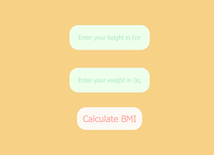

# kitna-mota-hu-mai
A BMI calculator!
___
### Usage
Clone this repository
`git clone https://github.com/ayushbasak/kitna-mota-hu-mai.git`
Change directory into *kitna-mota-hu-mai*
`cd kitna-mota-hu-mai`
Install the requirements: *(I dunno how to create requirements.txt :P)*
- Express
- body-parser
Run server
`node server.js`

Server will be available at `localhost:5000`

### Deployed on Heroku
[Site](https://kitnamotahumai.herokuapp.com/)

#### ScreenShots :

